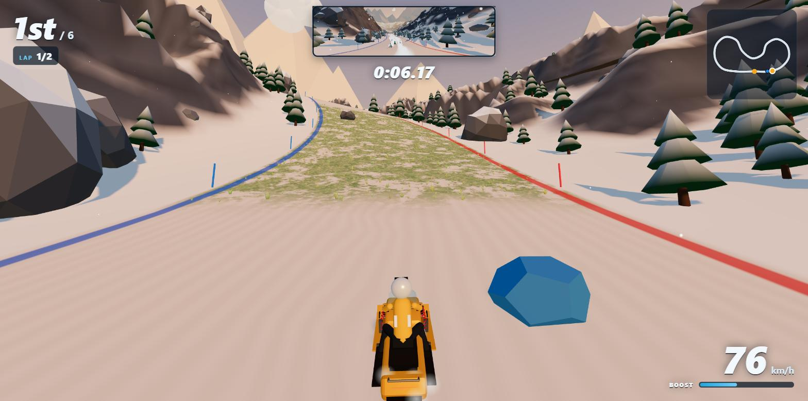
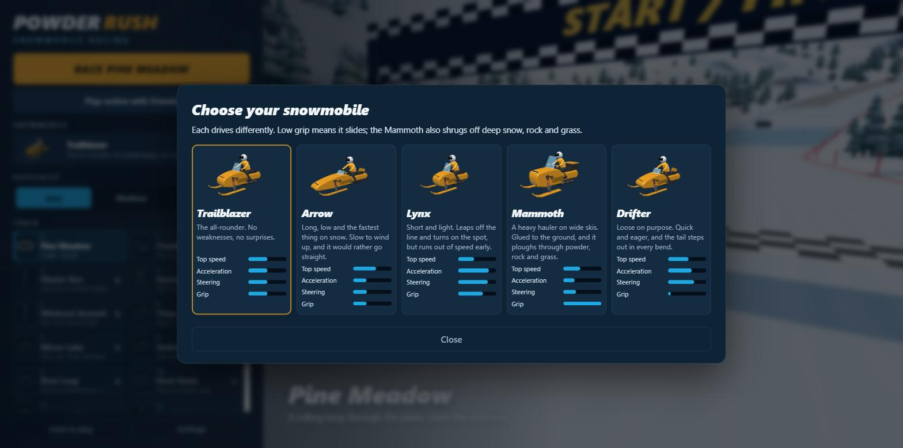
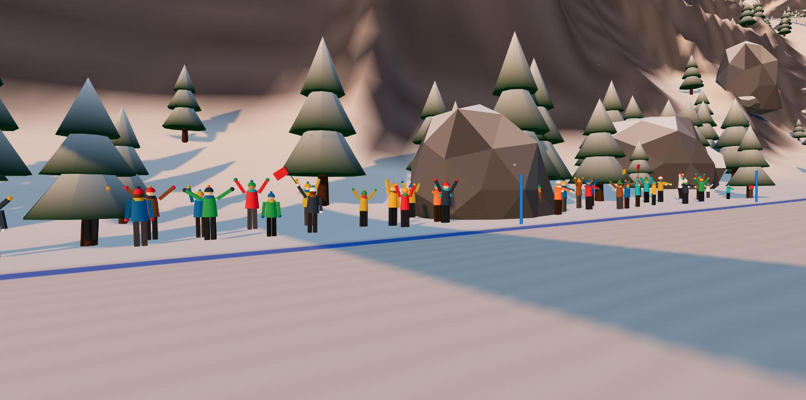
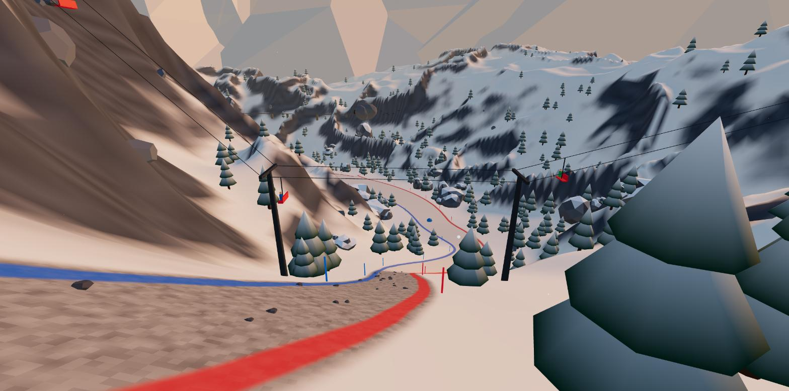
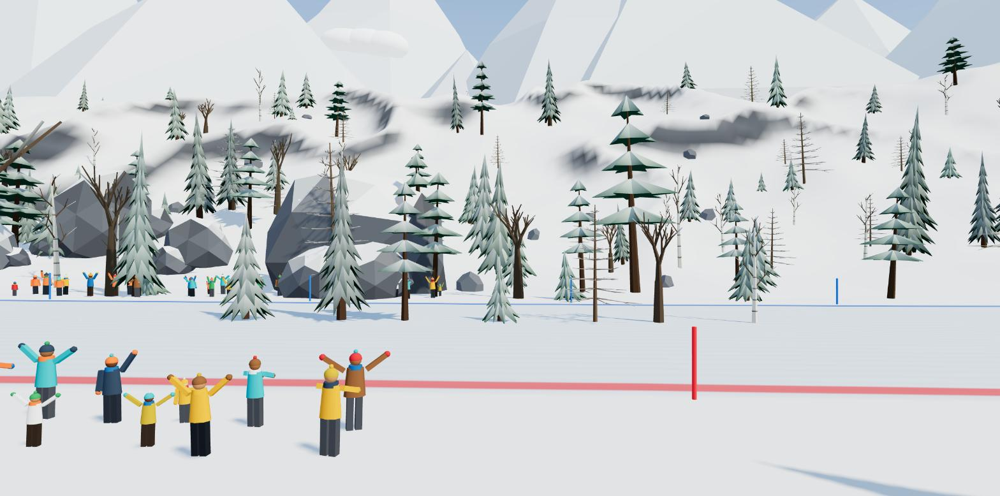
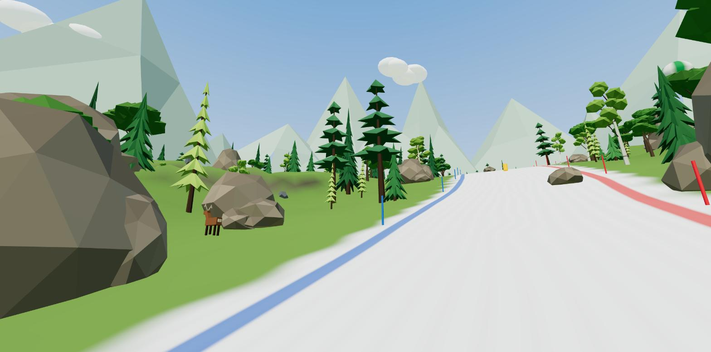
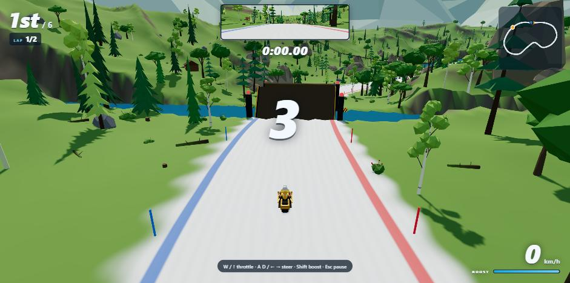
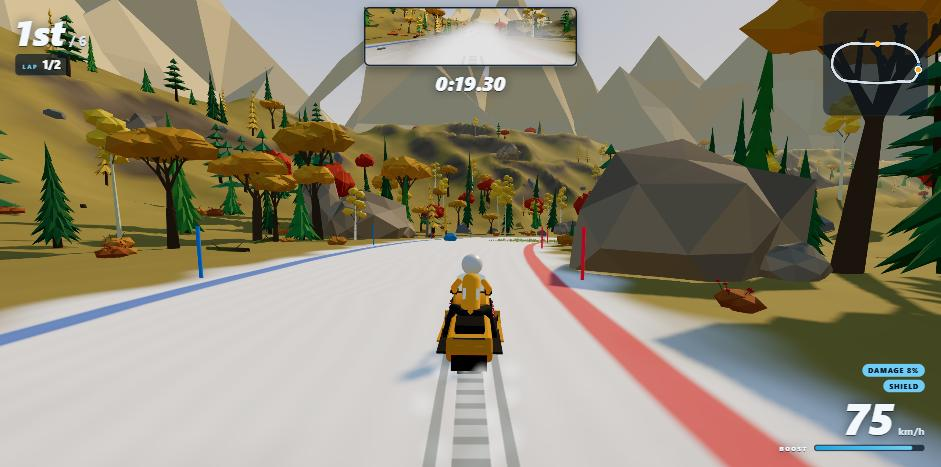
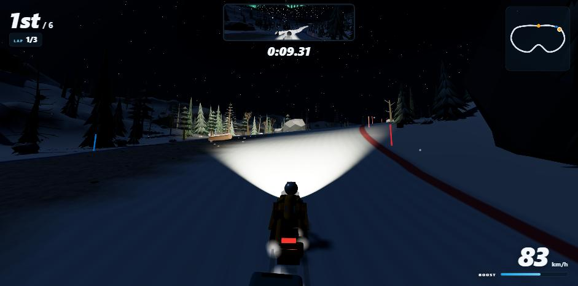

# Powder Rush — Snowmobile Racing

A 3D snowmobile racing game that runs in the browser. Race five AI riders to the finish across fourteen tracks, on three difficulty levels.

**Play it:** https://robertorenz.github.io/snowmobile/


| | |
|---|---|
|  |  |
| Track select, with a demo race behind it | The snowmobile and its working suspension |
|  |  |
| Mirror Lake: fast, slippery ice | Aurora Pass: night racing by headlight |
|  |  |
| Waterfalls and rock outcrops line the courses | Boulders and fallen logs block parts of the road |
|  | |
| A plunge: a 44% drop into a slalom | |

Built with [Three.js](https://threejs.org/), TypeScript and Vite. All models, terrain and sound are generated in code — there are no asset files.

## Run it

```
npm install
npm run dev
```

Then open http://localhost:5173. `npm run build` produces a static site in `dist/` that can be hosted anywhere. Every push to `main` is built and deployed to GitHub Pages by `.github/workflows/pages.yml`.

## Graphics levels

The game picks a graphics level from the computer's hardware the first time it runs, and you can change it under **Settings → Graphics** (the game reloads when you do).

| Level | Meant for | What it draws |
|---|---|---|
| High | A dedicated graphics card | Everything |
| Medium | Laptops and built-in graphics | Smaller shadows, native resolution at most, 60% of the trees, less undergrowth and snowfall |
| Low | No graphics card (software rendering) | No shadows or edge smoothing, three-quarter resolution, simple cone trees at a third of the number, no undergrowth, no clouds, birds, balloons, airliner, ski lift or cabins, flat ground colours, no rear-view mirror |

The course is the same at every level: same shape, surfaces, jumps and obstacles. Only the scenery around it changes. Fewer trees does mean fewer to hit.

At any level, if frames start taking too long the game lowers its drawing resolution a step at a time (down to 45%), and raises it again when there is time to spare.

## Controls

| Key | Action |
|---|---|
| `W` / `↑` | Throttle |
| `S` / `↓` | Brake, then reverse |
| `A` `D` / `←` `→` | Steer |
| `Shift` / `Space` | Boost (recharges slowly, faster in the air) |
| `R` | Reset onto the track |
| `Esc` / `P` | Pause |
| `V` | Rear-view mirror on / off |
| `M` | Mute |
| `F` | Flip while in the air |
| `E` / `Ctrl` | Throw a snowball |
| `C` | Change view: chase, rider, high behind (angled down the course), bird's-eye (straight down) |
| `X` / mouse wheel | Move the high and bird's-eye views further out: four distances each |

**Tricks:** hold `F` in the air to flip. Land it and each full rotation refills nearly half your boost; land part-way round and you wipe out and lose half your speed.

**Slipstream:** tuck in within about 20 m behind another sled and your top speed rises by 9%.

**Pickups** float over the road every 200 m or so and come back a few seconds after being taken:

| Pickup | Looks like | Effect |
|---|---|---|
| Boost | Amber canister | Refills the boost meter |
| Shield | Blue crystal | Soaks up the next snowball or crash |
| Snowball | White ball | Carry one and throw it down the road; a hit knocks a rider back to about half speed |
| Repair | Green box | Mends all damage (riders with none leave it for someone else) |

AI riders collect and use them too.

A rear-view mirror at the top of the screen shows who is behind you.



**Settings** (on the menu) has switches for the mirror, sound, and which surface patches appear on the road: ice, rock and shale, and grass can each be turned off.

On a phone or tablet, on-screen buttons appear the first time you touch the screen. There is a synthesised soundtrack; switch it off in Settings.

A gamepad also works: left stick steers, triggers are throttle and brake, A boosts, Start pauses.

## Ways to play

The menu's **Mode** switch chooses what the Race button starts.

| Mode | What it is |
|---|---|
| Race | You and five AI riders; top 3 unlocks the next level |
| Time trial | Alone against the clock. Each track has gold, silver and bronze times, and your best run comes back as a see-through ghost to race against |
| Knockout | Every so often the rider in last place is eliminated. Last one standing wins |
| Cup | A championship of four races scored on points (10, 7, 5, 3, 2, 1). There are four cups; each needs all its tracks unlocked |

**Coins:** solo races, time-trial medals and cups pay coins. Spend them in the snowmobile picker on paint and on three upgrades (engine, turbo, skis; three levels each, solo races only). The hood stripe colour is free to choose.

**After the flag:** the results screen offers a replay of the whole race, and while other riders are still out you can watch them finish (left and right switch rider).

**Damage:** a hard smash takes a little off your top speed, and it adds up. A green repair box fixes the sled.

**Photo mode:** pause a solo race and choose Photo mode to swing the camera round the sled and save a picture.

### Commentary, slow motion and the podium

- **Commentary:** a commentator calls the start, lead changes, places gained and lost, big jumps, flips, hits and the finish along the bottom of the screen. It can also be read aloud in the voice built into your browser.
- **Slow motion:** in a solo race, a big jump, a near miss with highway traffic or a close finish slows down for a moment. At most once every twelve seconds.
- **Podium:** a solo race ends with the top three on a podium at the finish line before the results. Press Continue, Enter or Esc to move on.
- **Records:** the menu's Records button lists your five best times on each track, from solo races and time trials. They are kept in your browser on this computer; there is no shared leaderboard, because the game has no server.

Commentary, spoken commentary and slow motion each have a switch in Settings.

## Track editor

The **Editor** button on the menu opens a map to lay out your own course.

- **Shape:** click to add a point, drag to move it, scroll the wheel (or use the Height slider) to raise or lower it, Delete to remove it. The road is drawn through the points and coloured by height, with a height profile underneath.
- **Settings:** circuit or point-to-point, laps, road width, one of six settings (winter day, dusk, glacier, night, blizzard, spring meadow), mountain height, number of trees, rocks and logs on the road, and a snowplough.
- **Features:** pick one, then click on the course to place it: jump, big hill, rollers, river jump, chasm, gate, highway, drawbridge, tunnel, rockfall or rolling logs.
- **Check:** the editor measures the course as you work and says what has to be fixed before it can be raced: under 500 m or over 5 km, a corner tighter than 16 m, a slope over 60%, or two stretches within 70 m of each other. A course can't cross over itself.
- **Race it:** "Save and race it" starts a race on the track; quitting the race brings you back to the editor. Saved tracks appear at the end of the track list, always unlocked, and work in every solo mode.
- **Share it:** "Copy this track's code" puts the track on the clipboard as a line of text. A friend pastes it into their editor and presses Load.

Tracks are saved in your browser on this computer. If you host an online room and start a race on one of your tracks, it is sent to the other players with the start signal.

## Snowmobiles

Pick one from the menu before racing (**Snowmobile → Change**). Each has its own shape and its own handling.

| Model | Character |
|---|---|
| Trailblazer | The all-rounder |
| Arrow | Long and low; the highest top speed, slow to accelerate, reluctant to turn |
| Lynx | Short and light; quickest off the line and sharpest steering, lowest top speed |
| Mammoth | Heavy, on wide skis; the most grip, and far less slowed by deep snow, rock and grass |
| Drifter | Quick and eager with very little grip, so it slides through every bend |

AI riders turn up on a mix of models but all drive to the same numbers, so the difficulty settings mean the same thing whatever they ride. Online, everyone sees each player's chosen model.



## Tracks and progression

| Level | Track | Type | Setting |
|---|---|---|---|
| 1 | Pine Meadow | Circuit, 3 laps | Clear day, rolling and forgiving; 2 jumps, 4 obstacles |
| 2 | Frostbite Ridge | Circuit, 2 laps | Golden hour, a 40 m climb; 4 jumps, 7 obstacles |
| 3 | Glacier Run | Point-to-point descent | Bright glacier, sweeping bends; 5 jumps, 10 obstacles |
| 4 | Aurora Pass | Circuit, 2 laps | Night, technical, headlights; 3 jumps, 9 obstacles |
| 5 | Whiteout Summit | Point-to-point descent | Blizzard, low visibility; 7 jumps, 14 obstacles |
| 6 | Thaw Meadow | Circuit, 2 laps | Green spring meadow where only the road holds snow; a river runs beside it |
| 7 | Mirror Lake | Circuit, 2 laps | Straight across a frozen lake: fast, open ice with almost no grip |
| 8 | Switchback Pass | Circuit, 2 laps | A 90 m climb through bends and over steep hills, then the plunge back down |
| 9 | River Leap | Circuit, 2 laps | A river cuts the course twice; jump it or swim |
| 10 | Farm Gates | Circuit, 2 laps | Three fences across a meadow road; clear the top rail |
| 11 | Highway Hop | Circuit, 2 laps | A highway with traffic crosses the course twice |
| 12 | Devil's Canyon | Point-to-point descent | Two chasms, a river, a gate and a highway, all downhill |
| 13 | The Corkscrew | Circuit, 2 laps | A figure of eight that crosses over itself on a bridge; two tunnels, two slalom plunges, bends down to a 14 m radius |
| 14 | Widowmaker | Point-to-point descent | Under its own bridge, two tunnels, four slalom plunges and a chasm before the line |

Every track widens and narrows along its length (from 8 m in the pinches, barely room for two sleds, to about 40 m in the open sections), has runs of tall rollers and some big single hills that are steep enough to slow a sled on the way up, and has obstacles on the racing surface: mostly big rocks and fallen logs, with some ice boulders and striped barriers. Hitting one costs most of your speed; the AI riders steer around them. Rivers (Pine Meadow, Thaw Meadow, Mirror Lake) run in a channel beside the track: ride into one and you are put back on the course at a standstill.

Finishing in the top 3 unlocks the next level. Best place and time are saved per track and difficulty in the browser's local storage.

Difficulty (Easy, Medium, Hard) changes how fast the AI riders are, how close to the limit they corner, and whether they use boost.

### Scenery

The ground beside each course is broken by rock ridges and clusters of outcrops (snow-capped in winter), and most tracks have a waterfall or two. Outcrops and waterfalls close to the course are solid. The circuits also climb and drop far more than their layouts suggest: Frostbite Ridge rises about 110 m and Switchback Pass about 190 m, with single hills of up to 25 m on top of that. Slopes pull hard: a steep climb can drag a sled down to 60 km/h, and the descents push it past its normal top speed.

### Surfaces

The snow road is broken up by patches of other ground, roughly one every 240 m on every track. Some cover the full width; others cover one half, leaving a clean line round them.

| Surface | Looks like | What it does |
|---|---|---|
| Ice | Blue, glossy | Next to no grip: the sled slides wherever it was already going, and throttle and brakes work at 40%. Ice is only laid on straights and gentle bends, and every track has at least one sheet |
| Shale | Dark gravel with loose stones | Top speed down about a quarter, and it rattles the suspension |
| Bare rock | Grey slabs with cracks | The slowest: top speed down 40% |
| Grass | Matted turf with clumps of grass blades | Top speed down about 15% |

AI riders slow for bends on ice and move to the clear half of the road when a slow patch covers only one side.


### Life around the course

Most of this is there to look at; the deer and the avalanche are the exceptions.

| | |
|---|---|
|  |  |
| The crowd at the start | A chairlift over the road |

- **Deer:** a few wander across the road on every track. Hit one and you're knocked back; it bolts.
- **Crowd and cabins:** spectators line the start, waving, cheering, clapping and jumping, some with flags; you hear them as you pass. Log cabins with lit windows sit in the hills.
- **Ski lift:** a chairlift crosses the valley over the road on every track.
- **Dusk:** Frostbite Ridge, Highway Hop and Switchback Pass start at golden hour and end in the dark, with stars out and your headlight on.
- **Weather:** every few minutes the fog closes in and the snow thickens, then it clears again.
- **Avalanche:** on Glacier Run, Whiteout Summit and Widowmaker, an avalanche breaks loose behind the leaders partway down and chases the field at about 145 km/h. Anyone it catches is buried and restarts from a standstill.
- **Steam train:** every track has a railway along the mountainside beside the course, with a locomotive pulling a tender and five carriages, smoke trailing from the chimney. It runs out of one rock tunnel and into another, then comes round again.
- **Sky:** drifting clouds, flocks of birds circling in V formation, three hot-air balloons, and an airliner with a contrail crossing about once a minute. At night there are no birds or balloons and the airliner shows a blinking beacon; in the blizzard only the train runs.


### Trees

The forest is a mix of eleven kinds of tree, each with its own shape: spruce, Douglas fir (the tallest), white pine (a long bare trunk under level whorls), young fir, cedar (a narrow column), tamarack, elm, birch, maple, aspen, and the odd dead snag. The trees that shed (tamarack, elm, birch, maple, aspen) stand bare with snow on their limbs on the winter tracks and are in leaf on the two meadow tracks.

Under them is undergrowth, thickest along the edge of the course: bushes (some with red berries), stumps and fallen trunks. You can ride through all of it; only the trees themselves are solid.

| | |
|---|---|
|  |  |
| Winter: conifers under snow, bare broadleaf trees | Meadow: the same species in leaf, with berry bushes |

### Plunges

Eleven of the twelve tracks (all but Mirror Lake) have at least one plunge: a drop of 24 to 75 m in under 200 m, with grades of 40 to 60%. On eight of them the drop is bent into a slalom with bends as tight as a 20 m radius, so it cannot be taken flat out: brake, swerve, and pick a line. On the circuits each plunge is paid for by an equally steep climb elsewhere on the lap. The camera tips down into drops and up at climbs so you can see what is coming.

### Bridges and tunnels

On the last two tracks the course crosses over itself: the higher pass rides on a bridge with 14 m of headroom, and the lower one runs underneath between the piers. Bridges and tunnels have solid sides, so there is no deep snow to run wide into; you scrape the wall and lose speed instead.

| | |
|---|---|
|  |  |
| The Corkscrew: under the bridge you will cross later in the lap | A tunnel |

### Crossings

Levels 9 to 12 are built around things you have to jump. Each has a ramp in front of it, flagged by striped warning boards, and each needs speed: roughly 90 km/h or more at the lip.

| Crossing | What it is | If you don't clear it |
|---|---|---|
| River | 12 m of open water across the course | You land in the water and restart before the ramp |
| Chasm | A 16 m pit | You fall in and restart before the ramp |
| Gate | A fence across the course, 16 m past the ramp | You hit the top rail and restart before the ramp |
| Highway | A two-lane road with cars and trucks | Traffic that hits you sends you back; the tarmac itself drags a sled almost to a stop |

A restart puts you about 95 m before the ramp, at a standstill, which is enough run-up to make the jump. Boost helps.

| | |
|---|---|
|  |  |
| River Leap | Devil's Canyon |
|  |  |
| Farm Gates | Highway Hop |

### Drawbridges

Thaw Meadow and the second river on River Leap are crossed by a drawbridge instead of a jump. It lifts on a timer: down for about nine seconds, then up for about six. The lamps on its towers are green while it is safe and flash red from two seconds before it starts to lift.

- **Down:** ride across.
- **Just starting to lift:** the leaves are a ramp, and you can jump off them.
- **Up:** it is a wall. Stop at the bank and wait, or you bounce off it.
- **On it when it goes up:** you drop into the river and restart 45 m back.

The AI riders time their approach and wait at the bank when they have to.



### Shortcuts

Five tracks have a shortcut: a narrow way cut across country that leaves the road at a "SHORTCUT" sign and rejoins it further on.

| Track | Road | Shortcut | Surface |
|---|---|---|---|
| Pine Meadow | 394 m | 278 m | Snow |
| Frostbite Ridge | 394 m | 267 m, dropping at up to 32% | Ice |
| Aurora Pass | 434 m | 254 m | Snow |
| The Corkscrew | 354 m | 247 m | Snow |
| Widowmaker | 378 m | 260 m | Ice |

A shortcut is 7 or 8 m wide, against 20 m or more for the road, with trees and rocks right at its edge and deep snow either side. The AI riders keep to the road, so it is yours to gamble on.

### Moving hazards

| Hazard | Where | What it does |
|---|---|---|
| Snowplough | Pine Meadow, Highway Hop | Crawls round the course in one lane at about 30 km/h. Solid: run into it and you bounce off |
| Rockfall | Glacier Run, Devil's Canyon, Widowmaker | Boulders come bounding across a stretch of road, one chute after another. Get in the way of one and it knocks you about |
| Rolling logs | Whiteout Summit, Farm Gates | Logs roll down a stretch of road toward you, each in a different lane every time. They can be jumped |

All of them run off the race clock, so everyone in an online race sees them in the same place.

### Seasons and night

Under **Season and light** on the menu, any track can be run in a different season, and by day or at night.

| Setting | What it does |
|---|---|
| Set | Each track as it was designed |
| Winter | Snow everywhere, including the meadow tracks |
| Spring | Green meadow with snow only on the road |
| Autumn | Dry grass, with the broadleaf trees turned gold, orange and red |
| Night | Added to any of the above: a dark sky with stars and aurora, and fog that hides everything your headlight doesn't reach. Every sled shows a headlamp and a red tail light |

A season changes which surface patches appear on the road, so times in different seasons aren't quite comparable. In an online room the host's choice is used for everyone.

| | |
|---|---|
|  |  |
| Mirror Lake in autumn | Pine Meadow at night |

### Snow that remembers

Every sled leaves a trail in the snow that stays for the race. The snow under it packs down too: about three passes over the same line and it is fully packed, which is worth 5% more top speed. "PACKED SNOW" shows on the HUD while you are on it. So the racing line gets quicker as the race goes on, and following where others have been pays. Low graphics doesn't draw the trails, but the packed line is still there.

## Online multiplayer

Up to six people can race each other, each on their own computer.

1. One player clicks **Play online with friends**, enters a name and chooses **Create a room**.
2. They share the 4-letter room code, or the invite link from **Copy invite link**.
3. Friends open the game, click **Play online with friends** and join with the code (the invite link fills it in).
4. The host picks the track and AI difficulty and starts the race. Empty seats are filled with AI riders.

Every track is available in an online room, and online results do not affect solo progression.

How it works: players connect directly to the host's browser over WebRTC (via [PeerJS](https://peerjs.com/), whose free public server is used only to introduce the players to each other). Each computer simulates its own sled, the host simulates the AI riders, and positions are exchanged about 20 times a second. There is no game server, so:

- The room exists only while the host keeps the game open, and the host's tab must stay visible (browsers pause hidden tabs).
- An online race cannot be paused. When the host leaves a race, it ends for everyone.
- Some strict corporate or mobile networks block direct connections; joining will then time out.

The host can run a cup for the room (choose Cup in the Mode switch): four races with points for everyone, moved on by the host. The room has a chat box, and each player's chosen snowmobile is shown to everyone. Snowball hits carry across the network.

## How it is put together

| File | What it does |
|---|---|
| `src/tracks.ts` | Track definitions (control points, jumps, theme) and difficulty settings. Add a track here. |
| `src/track.ts` | Turns control points into an evenly sampled centerline with curvature and slope. |
| `src/terrain.ts` | Heightmap terrain shaped around the track; snow shader with edge lines and start/finish chequers. |
| `src/world.ts` | Scene for one track: trees, rocks, marker poles, gates, sky, snowfall, lighting. |
| `src/ambient.ts` | Scenery with a life of its own: the train, clouds, birds, balloons and airliner. |
| `src/sleds.ts` | The snowmobile models: proportions and handling numbers. Add a model here. |
| `src/sled.ts`, `src/sledModel.ts` | Snowmobile physics (arcade handling, jumps, collisions, ice) and the model, including its working suspension: the body rides on springs and each ski follows the snow under it. |
| `src/ai.ts` | AI rider: racing line, corner speed, traffic avoidance, boost, recovery. |
| `src/race.ts` | Grid, countdown, laps, positions, finish and results. |
| `src/net.ts` | Online rooms: hosting, joining, lobby and the messages exchanged during a race. |
| `src/quality.ts` | The graphics levels and the hardware check that chooses one. |
| `src/trails.ts` | Sled trails in the snow and the packed racing line. |
| `src/hazards.ts` | The snowplough, rockfalls, rolling logs, and the drawbridge timing. |
| `src/commentary.ts` | The race commentator. |
| `src/podium.ts` | The podium scene after a race. |
| `src/custom.ts`, `src/editor.ts` | Tracks made in the editor: the format, the checks, saving, share codes, and the editor itself. |
| `src/ui.ts`, `src/style.css` | Menu, HUD, minimap and modal dialogs. |
| `src/main.ts` | Game loop, camera, and glue between the above. |

### Adding a track

Add an entry to `TRACKS` in `src/tracks.ts`. Besides the control points (whose y values set the hills), a track can list `widths` (width keyframes), `jumps`, `rollers` (a count of 1 makes a single big hill), `elevation` (multiplies the climbs), `plunges` and `slaloms` (steep drops and the weave through them), `bridges` (a point where the course crosses itself) and `tunnels`, `rugged` and `crags` (rock ridges and outcrops), `waterfalls`, a number of `obstacles`, a `river` and a `lake`, and `crossings` (river, chasm, gate or highway, each placed on a straight); set `meadow` on the theme for grass with a snow road. Then run `npm run check-tracks`. It reports each track's length, tightest corner, and how close separate stretches of the course come to each other; keep the minimum separation above about 110 m so the terrain can blend between them.
