# Powder Rush — Snowmobile Racing

A 3D snowmobile racing game that runs in the browser. Race five AI riders to the finish across fourteen tracks, on three difficulty levels.

**Play it:** https://robertorenz.github.io/snowmobile/

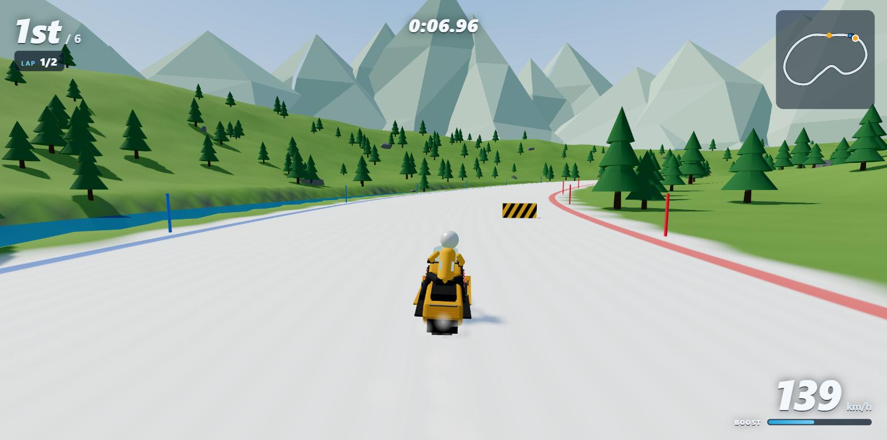

| | |
|---|---|
| 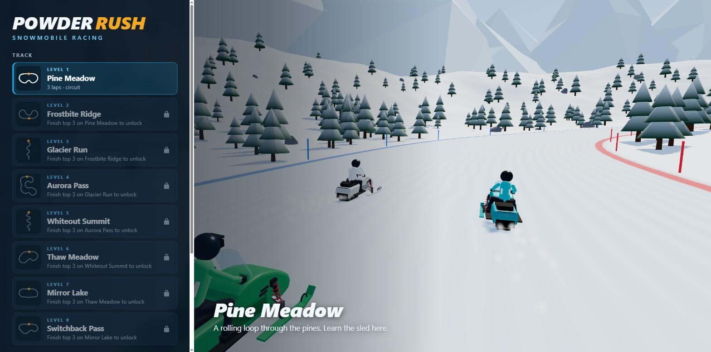 | 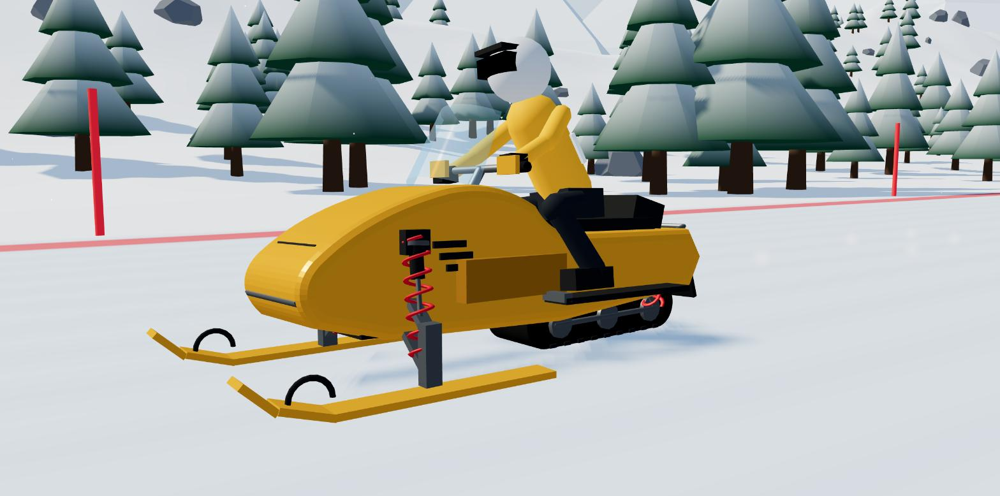 |
| Track select, with a demo race behind it | The snowmobile and its working suspension |
| 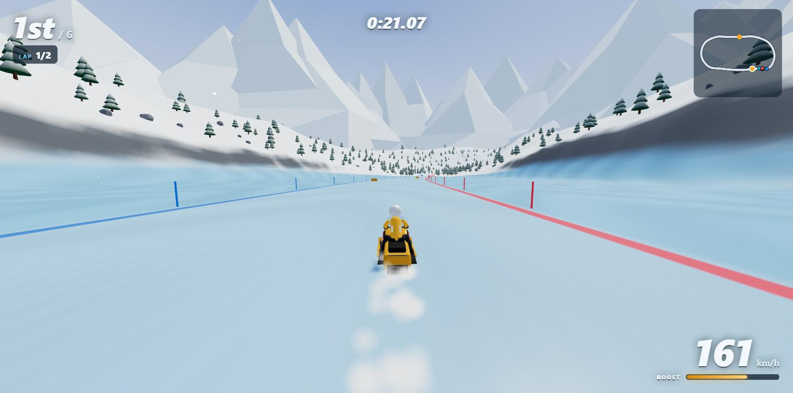 | 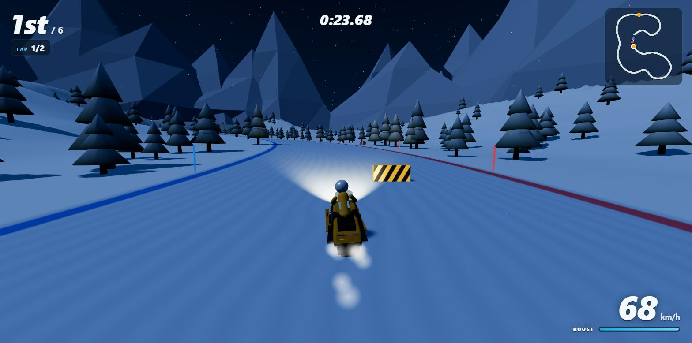 |
| Mirror Lake: fast, slippery ice | Aurora Pass: night racing by headlight |
| 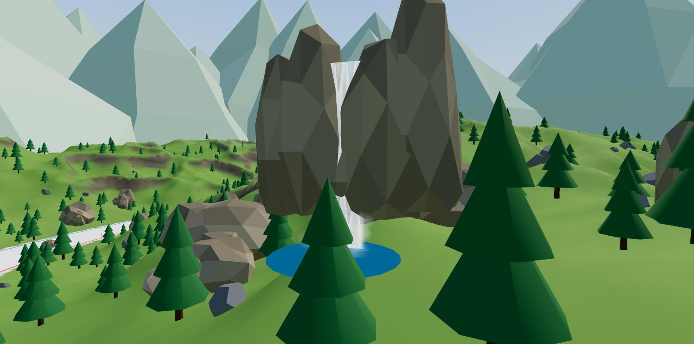 | 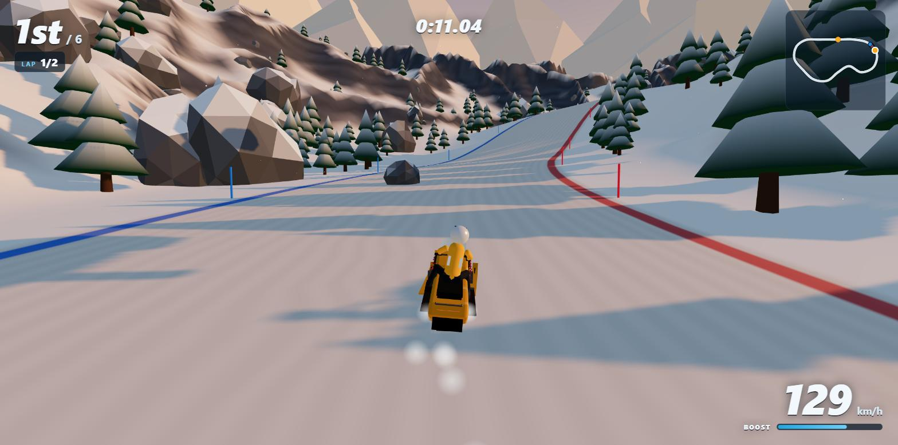 |
| Waterfalls and rock outcrops line the courses | Boulders and fallen logs block parts of the road |
| 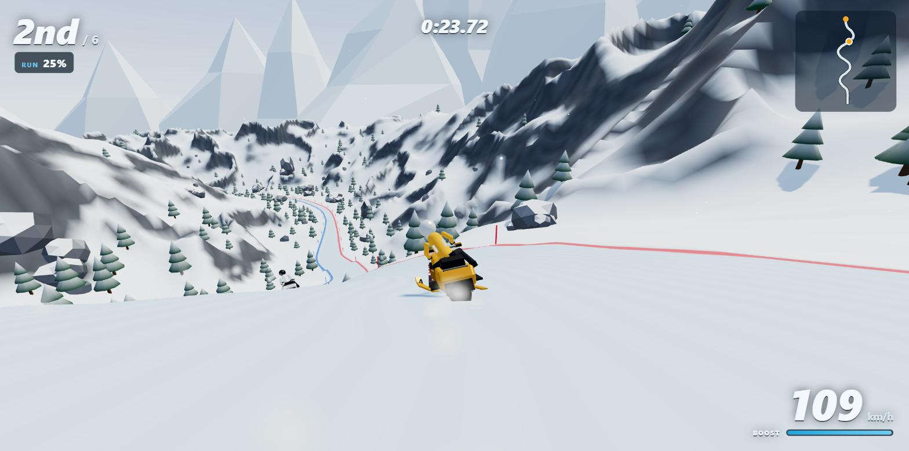 | |
| A plunge: a 44% drop into a slalom | |

Built with [Three.js](https://threejs.org/), TypeScript and Vite. All models, terrain and sound are generated in code — there are no asset files.

## Run it

```
npm install
npm run dev
```

Then open http://localhost:5173. `npm run build` produces a static site in `dist/` that can be hosted anywhere. Every push to `main` is built and deployed to GitHub Pages by `.github/workflows/pages.yml`.

## Controls

| Key | Action |
|---|---|
| `W` / `↑` | Throttle |
| `S` / `↓` | Brake, then reverse |
| `A` `D` / `←` `→` | Steer |
| `Shift` / `Space` | Boost (recharges slowly, faster in the air) |
| `R` | Reset onto the track |
| `Esc` / `P` | Pause |
| `M` | Mute |

A gamepad also works: left stick steers, triggers are throttle and brake, A boosts, Start pauses.

## Tracks and progression

| Level | Track | Type | Setting |
|---|---|---|---|
| 1 | Pine Meadow | Circuit, 3 laps | Clear day, rolling and forgiving; 2 jumps, 4 obstacles |
| 2 | Frostbite Ridge | Circuit, 2 laps | Golden hour, a 40 m climb; 4 jumps, 7 obstacles |
| 3 | Glacier Run | Point-to-point descent | Bright glacier, sweeping bends; 5 jumps, 10 obstacles |
| 4 | Aurora Pass | Circuit, 2 laps | Night, technical, headlights; 3 jumps, 9 obstacles |
| 5 | Whiteout Summit | Point-to-point descent | Blizzard, low visibility; 7 jumps, 14 obstacles |
| 6 | Thaw Meadow | Circuit, 2 laps | Green spring meadow where only the road holds snow; a river runs beside it |
| 7 | Mirror Lake | Circuit, 2 laps | Straight across a frozen lake: fast, open ice with almost no grip |
| 8 | Switchback Pass | Circuit, 2 laps | A 90 m climb through bends and over steep hills, then the plunge back down |
| 9 | River Leap | Circuit, 2 laps | A river cuts the course twice; jump it or swim |
| 10 | Farm Gates | Circuit, 2 laps | Three fences across a meadow road; clear the top rail |
| 11 | Highway Hop | Circuit, 2 laps | A highway with traffic crosses the course twice |
| 12 | Devil's Canyon | Point-to-point descent | Two chasms, a river, a gate and a highway, all downhill |
| 13 | The Corkscrew | Circuit, 2 laps | A figure of eight that crosses over itself on a bridge; two tunnels, two slalom plunges, bends down to a 14 m radius |
| 14 | Widowmaker | Point-to-point descent | Under its own bridge, two tunnels, four slalom plunges and a chasm before the line |

Every track widens and narrows along its length (from 8 m in the pinches, barely room for two sleds, to about 40 m in the open sections), has runs of tall rollers and some big single hills that are steep enough to slow a sled on the way up, and has obstacles on the racing surface: mostly big rocks and fallen logs, with some ice boulders and striped barriers. Hitting one costs most of your speed; the AI riders steer around them. Rivers (Pine Meadow, Thaw Meadow, Mirror Lake) run in a channel beside the track: ride into one and you are put back on the course at a standstill.

Finishing in the top 3 unlocks the next level. Best place and time are saved per track and difficulty in the browser's local storage.

Difficulty (Easy, Medium, Hard) changes how fast the AI riders are, how close to the limit they corner, and whether they use boost.

### Scenery

The ground beside each course is broken by rock ridges and clusters of outcrops (snow-capped in winter), and most tracks have a waterfall or two. Outcrops and waterfalls close to the course are solid. The circuits also climb and drop far more than their layouts suggest: Frostbite Ridge rises about 110 m and Switchback Pass about 190 m, with single hills of up to 25 m on top of that. Slopes pull hard: a steep climb can drag a sled down to 60 km/h, and the descents push it past its normal top speed.

### Surfaces

The snow road is broken up by patches of other ground, roughly one every 240 m on every track. Some cover the full width; others cover one half, leaving a clean line round them.

| Surface | Looks like | What it does |
|---|---|---|
| Ice | Blue, glossy | Next to no grip: the sled slides wherever it was already going, and throttle and brakes work at 40%. Ice is only laid on straights and gentle bends |
| Shale | Dark gravel with loose stones | Top speed down about a quarter, and it rattles the suspension |
| Bare rock | Grey slabs with cracks | The slowest: top speed down 40% |
| Grass | Matted turf with clumps of grass blades | Top speed down about 15% |

AI riders slow for bends on ice and move to the clear half of the road when a slow patch covers only one side.

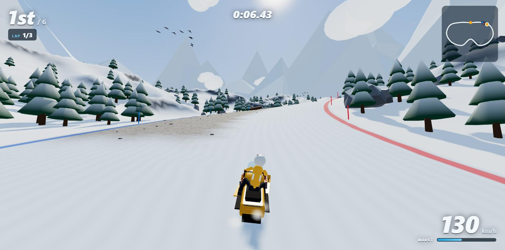

### Life around the course

None of this affects the race; it is there to look at.

- **Steam train:** every track has a railway along the mountainside beside the course, with a locomotive pulling a tender and five carriages, smoke trailing from the chimney. It runs out of one rock tunnel and into another, then comes round again.
- **Sky:** drifting clouds, flocks of birds circling in V formation, three hot-air balloons, and an airliner with a contrail crossing about once a minute. At night there are no birds or balloons and the airliner shows a blinking beacon; in the blizzard only the train runs.

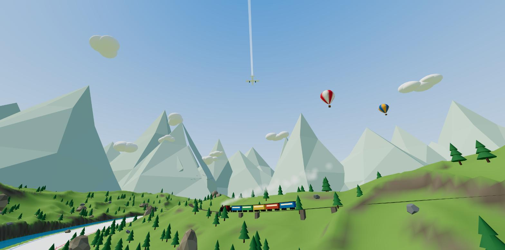

### Plunges

Eleven of the twelve tracks (all but Mirror Lake) have at least one plunge: a drop of 24 to 75 m in under 200 m, with grades of 40 to 60%. On eight of them the drop is bent into a slalom with bends as tight as a 20 m radius, so it cannot be taken flat out: brake, swerve, and pick a line. On the circuits each plunge is paid for by an equally steep climb elsewhere on the lap. The camera tips down into drops and up at climbs so you can see what is coming.

### Bridges and tunnels

On the last two tracks the course crosses over itself: the higher pass rides on a bridge with 14 m of headroom, and the lower one runs underneath between the piers. Bridges and tunnels have solid sides, so there is no deep snow to run wide into; you scrape the wall and lose speed instead.

| | |
|---|---|
| 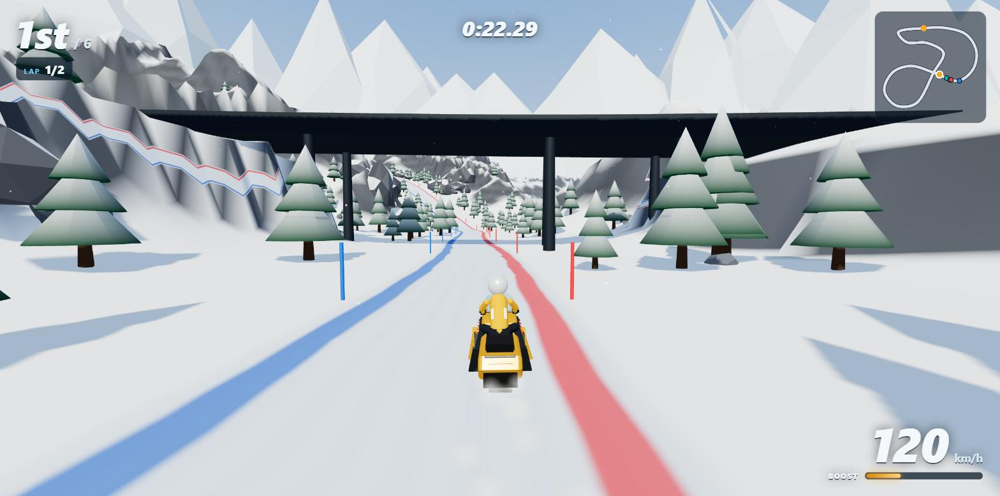 | 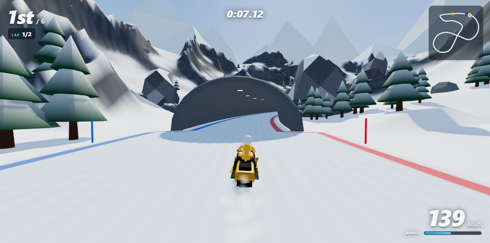 |
| The Corkscrew: under the bridge you will cross later in the lap | A tunnel |

### Crossings

Levels 9 to 12 are built around things you have to jump. Each has a ramp in front of it, flagged by striped warning boards, and each needs speed: roughly 90 km/h or more at the lip.

| Crossing | What it is | If you don't clear it |
|---|---|---|
| River | 12 m of open water across the course | You land in the water and restart before the ramp |
| Chasm | A 16 m pit | You fall in and restart before the ramp |
| Gate | A fence across the course, 16 m past the ramp | You hit the top rail and restart before the ramp |
| Highway | A two-lane road with cars and trucks | Traffic that hits you sends you back; the tarmac itself drags a sled almost to a stop |

A restart puts you about 95 m before the ramp, at a standstill, which is enough run-up to make the jump. Boost helps.

| | |
|---|---|
| 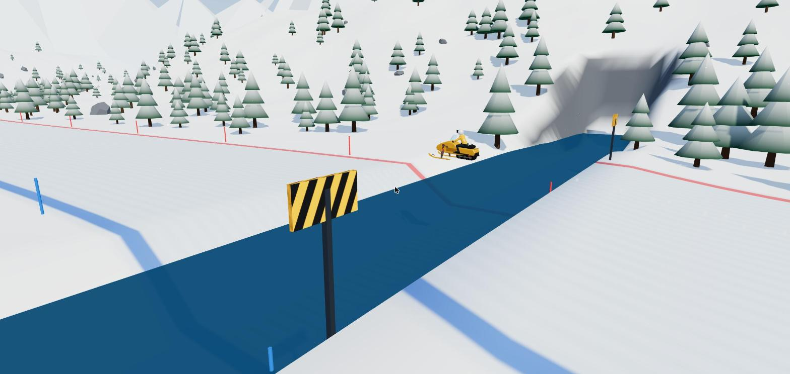 | 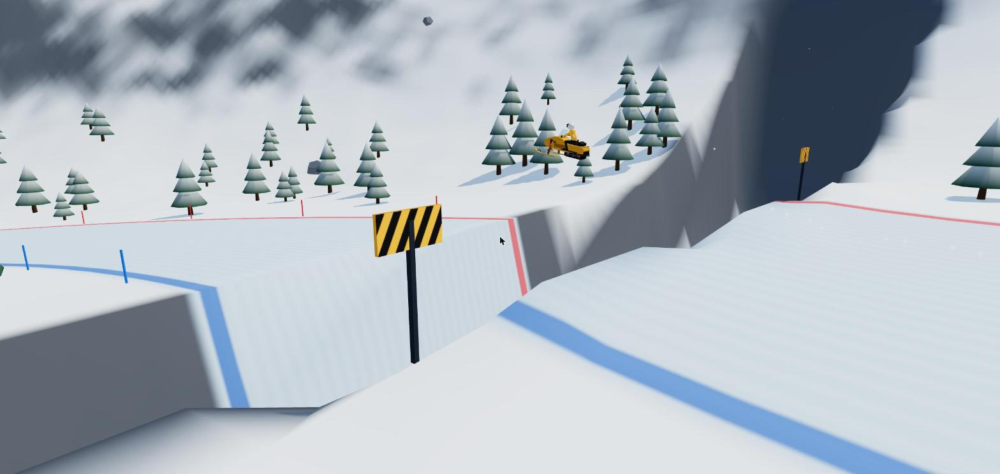 |
| River Leap | Devil's Canyon |
| 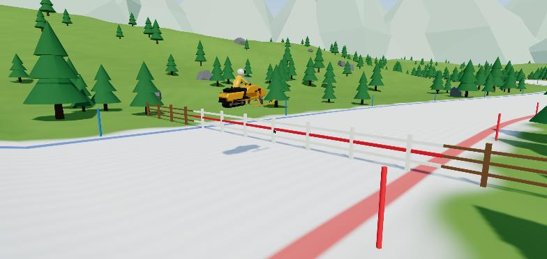 | 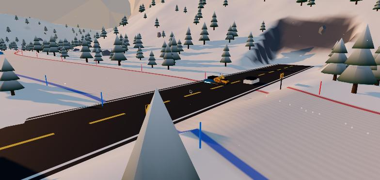 |
| Farm Gates | Highway Hop |

## Online multiplayer

Up to six people can race each other, each on their own computer.

1. One player clicks **Play online with friends**, enters a name and chooses **Create a room**.
2. They share the 4-letter room code, or the invite link from **Copy invite link**.
3. Friends open the game, click **Play online with friends** and join with the code (the invite link fills it in).
4. The host picks the track and AI difficulty and starts the race. Empty seats are filled with AI riders.

Every track is available in an online room, and online results do not affect solo progression.

How it works: players connect directly to the host's browser over WebRTC (via [PeerJS](https://peerjs.com/), whose free public server is used only to introduce the players to each other). Each computer simulates its own sled, the host simulates the AI riders, and positions are exchanged about 20 times a second. There is no game server, so:

- The room exists only while the host keeps the game open, and the host's tab must stay visible (browsers pause hidden tabs).
- An online race cannot be paused. When the host leaves a race, it ends for everyone.
- Some strict corporate or mobile networks block direct connections; joining will then time out.

## How it is put together

| File | What it does |
|---|---|
| `src/tracks.ts` | Track definitions (control points, jumps, theme) and difficulty settings. Add a track here. |
| `src/track.ts` | Turns control points into an evenly sampled centerline with curvature and slope. |
| `src/terrain.ts` | Heightmap terrain shaped around the track; snow shader with edge lines and start/finish chequers. |
| `src/world.ts` | Scene for one track: trees, rocks, marker poles, gates, sky, snowfall, lighting. |
| `src/ambient.ts` | Scenery with a life of its own: the train, clouds, birds, balloons and airliner. |
| `src/sled.ts`, `src/sledModel.ts` | Snowmobile physics (arcade handling, jumps, collisions, ice) and the model, including its working suspension: the body rides on springs and each ski follows the snow under it. |
| `src/ai.ts` | AI rider: racing line, corner speed, traffic avoidance, boost, recovery. |
| `src/race.ts` | Grid, countdown, laps, positions, finish and results. |
| `src/net.ts` | Online rooms: hosting, joining, lobby and the messages exchanged during a race. |
| `src/ui.ts`, `src/style.css` | Menu, HUD, minimap and modal dialogs. |
| `src/main.ts` | Game loop, camera, and glue between the above. |

### Adding a track

Add an entry to `TRACKS` in `src/tracks.ts`. Besides the control points (whose y values set the hills), a track can list `widths` (width keyframes), `jumps`, `rollers` (a count of 1 makes a single big hill), `elevation` (multiplies the climbs), `plunges` and `slaloms` (steep drops and the weave through them), `bridges` (a point where the course crosses itself) and `tunnels`, `rugged` and `crags` (rock ridges and outcrops), `waterfalls`, a number of `obstacles`, a `river` and a `lake`, and `crossings` (river, chasm, gate or highway, each placed on a straight); set `meadow` on the theme for grass with a snow road. Then run `npm run check-tracks`. It reports each track's length, tightest corner, and how close separate stretches of the course come to each other; keep the minimum separation above about 110 m so the terrain can blend between them.
