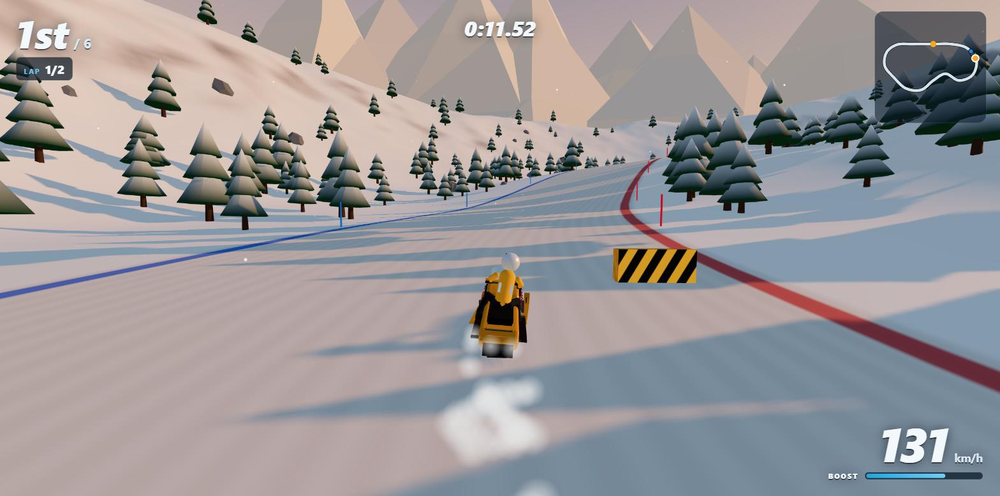

# Powder Rush — Snowmobile Racing

A 3D snowmobile racing game that runs in the browser. Race five AI riders to the finish across eight tracks, on three difficulty levels.

**Play it:** https://robertorenz.github.io/snowmobile/


| | |
|---|---|
|  |  |
| Track select, with a demo race behind it | The snowmobile and its working suspension |
|  |  |
| Mirror Lake: fast, slippery ice | Aurora Pass: night racing by headlight |
|  | |
| Switchback Pass: steep hills and obstacles | |

Built with [Three.js](https://threejs.org/), TypeScript and Vite. All models, terrain and sound are generated in code — there are no asset files.

## Run it

```
npm install
npm run dev
```

Then open http://localhost:5173. `npm run build` produces a static site in `dist/` that can be hosted anywhere. Every push to `main` is built and deployed to GitHub Pages by `.github/workflows/pages.yml`.

## Controls

| Key | Action |
|---|---|
| `W` / `↑` | Throttle |
| `S` / `↓` | Brake, then reverse |
| `A` `D` / `←` `→` | Steer |
| `Shift` / `Space` | Boost (recharges slowly, faster in the air) |
| `R` | Reset onto the track |
| `Esc` / `P` | Pause |
| `M` | Mute |

A gamepad also works: left stick steers, triggers are throttle and brake, A boosts, Start pauses.

## Tracks and progression

| Level | Track | Type | Setting |
|---|---|---|---|
| 1 | Pine Meadow | Circuit, 3 laps | Clear day, rolling and forgiving; 2 jumps, 4 obstacles |
| 2 | Frostbite Ridge | Circuit, 2 laps | Golden hour, a 40 m climb; 4 jumps, 7 obstacles |
| 3 | Glacier Run | Point-to-point descent | Bright glacier, sweeping bends; 5 jumps, 10 obstacles |
| 4 | Aurora Pass | Circuit, 2 laps | Night, technical, headlights; 3 jumps, 9 obstacles |
| 5 | Whiteout Summit | Point-to-point descent | Blizzard, low visibility; 7 jumps, 14 obstacles |
| 6 | Thaw Meadow | Circuit, 2 laps | Green spring meadow where only the road holds snow; a river runs beside it |
| 7 | Mirror Lake | Circuit, 2 laps | Straight across a frozen lake: fast, open ice with almost no grip |
| 8 | Switchback Pass | Circuit, 2 laps | A 90 m climb through bends and over steep hills, then the plunge back down |

Every track widens and narrows along its length (from about 14 m in the squeezes to 34 m in the open sections), has runs of tall rollers and some big single hills that are steep enough to slow a sled on the way up, and has striped barriers and ice boulders on the racing surface. Hitting one costs most of your speed; the AI riders steer around them. Rivers (Pine Meadow, Thaw Meadow, Mirror Lake) run in a channel beside the track: ride into one and you are put back on the course at a standstill.

Finishing in the top 3 unlocks the next level. Best place and time are saved per track and difficulty in the browser's local storage.

Difficulty (Easy, Medium, Hard) changes how fast the AI riders are, how close to the limit they corner, and whether they use boost.

## Online multiplayer

Up to six people can race each other, each on their own computer.

1. One player clicks **Play online with friends**, enters a name and chooses **Create a room**.
2. They share the 4-letter room code, or the invite link from **Copy invite link**.
3. Friends open the game, click **Play online with friends** and join with the code (the invite link fills it in).
4. The host picks the track and AI difficulty and starts the race. Empty seats are filled with AI riders.

Every track is available in an online room, and online results do not affect solo progression.

How it works: players connect directly to the host's browser over WebRTC (via [PeerJS](https://peerjs.com/), whose free public server is used only to introduce the players to each other). Each computer simulates its own sled, the host simulates the AI riders, and positions are exchanged about 20 times a second. There is no game server, so:

- The room exists only while the host keeps the game open, and the host's tab must stay visible (browsers pause hidden tabs).
- An online race cannot be paused. When the host leaves a race, it ends for everyone.
- Some strict corporate or mobile networks block direct connections; joining will then time out.

## How it is put together

| File | What it does |
|---|---|
| `src/tracks.ts` | Track definitions (control points, jumps, theme) and difficulty settings. Add a track here. |
| `src/track.ts` | Turns control points into an evenly sampled centerline with curvature and slope. |
| `src/terrain.ts` | Heightmap terrain shaped around the track; snow shader with edge lines and start/finish chequers. |
| `src/world.ts` | Scene for one track: trees, rocks, marker poles, gates, sky, snowfall, lighting. |
| `src/sled.ts`, `src/sledModel.ts` | Snowmobile physics (arcade handling, jumps, collisions, ice) and the model, including its working suspension: the body rides on springs and each ski follows the snow under it. |
| `src/ai.ts` | AI rider: racing line, corner speed, traffic avoidance, boost, recovery. |
| `src/race.ts` | Grid, countdown, laps, positions, finish and results. |
| `src/net.ts` | Online rooms: hosting, joining, lobby and the messages exchanged during a race. |
| `src/ui.ts`, `src/style.css` | Menu, HUD, minimap and modal dialogs. |
| `src/main.ts` | Game loop, camera, and glue between the above. |

### Adding a track

Add an entry to `TRACKS` in `src/tracks.ts`. Besides the control points (whose y values set the hills), a track can list `widths` (width keyframes), `jumps`, `rollers` (a count of 1 makes a single big hill), a number of `obstacles`, a `river` and a `lake`; set `meadow` on the theme for grass with a snow road. Then run `npm run check-tracks`. It reports each track's length, tightest corner, and how close separate stretches of the course come to each other; keep the minimum separation above about 110 m so the terrain can blend between them.
